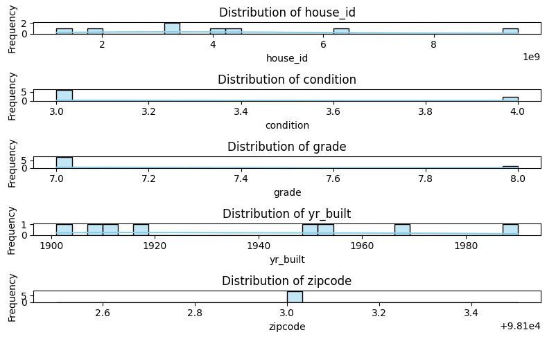
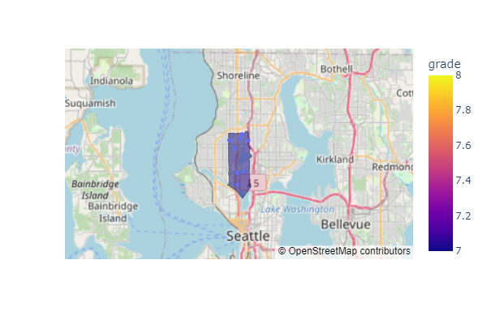
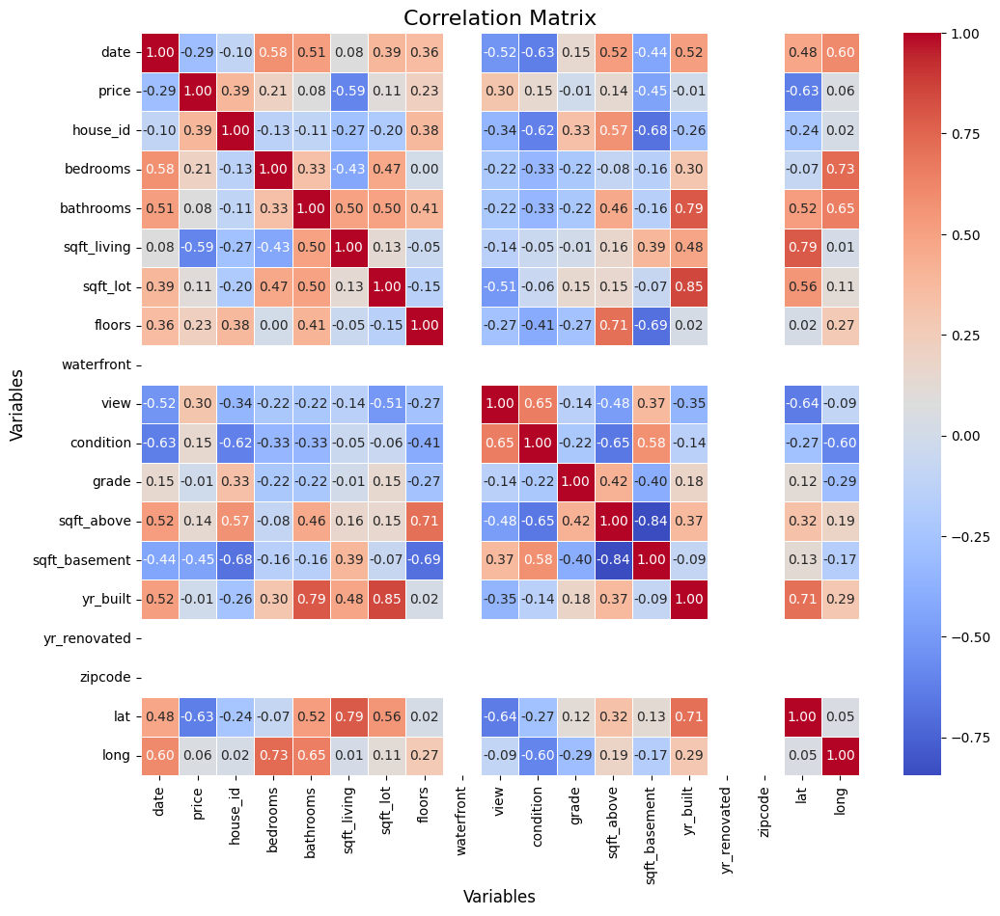
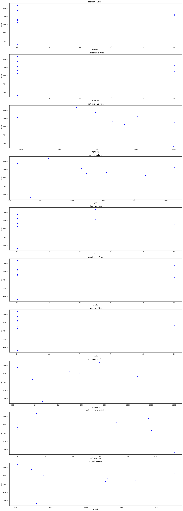
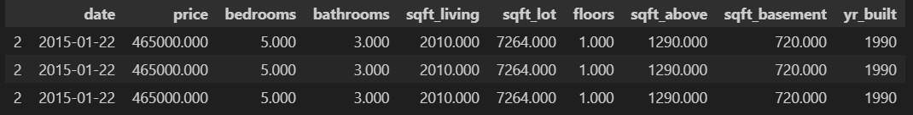

# Housing Recommendations
- Housing Recommendation by Manish

## Buyer Requirements
- The fictional Buyer Thomas Hansen has following requirements: 
    -   5 Kids, no Money, nice(social) neighbourhood
    - Timing?, Location? slightly unclear(probably low prio)
    - Buyer is looking near Seattle, Washington Area

## Basis
- The Basis of this Recommendation is the King County Housing Data

- This Dataset lists all the House Sales with Details over the last 1 Year Timeperiod in Zipcodes around the Seattle, Washington Area. 

- The Dataset was pulled into our local Records to
investigate the best possiblities as per Requirements for Thomas Hansen

- To arrive at the recommendations EDA Methodology and 
Visualization Methodology were suitably applied as explained below. 

## Exploratory Data Analysis Method

- After cleaning and sorting, the Data was queried for suitable records based on following criteria:
    -   Number of Bedrooms: 4 and more
    -   Number of Bathrooms: 2 and more
    -   Price: Less than half a million
    -   Location and Timing: Social Neighborhoods with Kids where houses have been available for recent sales

- After sorting and matching the suitable Match-records were re-stored for visualization.

## Visualization  
- A suitable Distribution of our pre-sorted Records show us how it reflects our Requirements:
   
   
- All sorted housing was mapped on a Geo Map to reveal a target suitable Area for our Requirements:
   

- A simple co-relation between key elements to identify the most important elements relevant to our requirements:

- A detailed co-relation between key elements to identify the most important elements relevant to our requirements: 

## Recommendations
- Based on the above Requirements, corresponding Analysis and Visualizations we came up with the following 3 Recommendations: 

